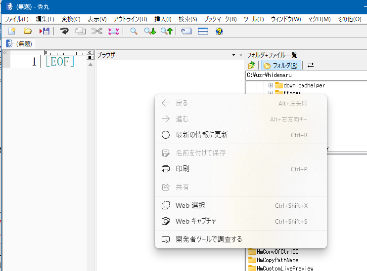
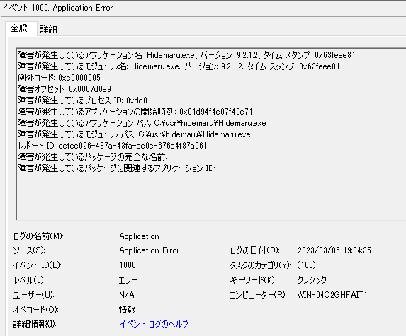

# 「WebView2ランタイム」がインストールされていると、ブラウザ枠が異様にバグりやすい疑惑あり

# バグの最も簡単な再現方法
「**空のブラウザ枠**」に次のようなマクロを送信してみる

```
setbrowserpaneurl "javascript:window.scrollBy(0,100);";
```

これにより、ブラウザ枠のみならず秀丸エディタが異常状態になっている  
(何かのタスク終了を待ち続けており、結果、マクロが終了しない状態だと思われる)

# 異常状態になっている時の様子
秀丸がおそらくマクロ実行中扱いとなってしまい、ほとんど操作できなくなる。  
秀丸を閉じると、終了時に保護違反が発生する。

ブラウザ枠にて右クリックすると秀丸側で用意してあるメニューではなく、  
次のようなWebView2の元来のコンポーネントのメニューが出るので、  
異常な状態かどうかがわかりやすい  



# 4台のPCでこの異常状態の再現を試みた

|  対象秀丸  |
| --- |
|hm921b2_x64_signed.exe|
|(秀丸エディタ32bit版のみならず、**秀丸エディタ64bit版でも同様の状況**が再現すると思われる)|

異なるマシンでこの異常状態の再現をトライしたところ、３台は全く同様に再現し、  
１台は通常状態では再現しなかったが、とある方法で再現した。

|  マシン名  |  OS  | バージョン | ビルド | 上記のバグ再現確率 |
|---|---|---|---|---|
| r9-3950x-X570  | Windows 11 Pro | 22H2 | 22621.1344 | 実行する度に100％<br>**新規に秀丸をインストールでも100％**<br>**秀丸64bit版でも100％** |
| i9-9900ks-B365 | Windows 11 Pro | 22H2 | 22621.1344 | 実行する度に100％<br>(他の状況は試行せず) |
| i7-9700-H310 | Windows 11 Pro | 22H2 | 22621.1344 | 実行する度に100％<br>(他の状況は試行せず) |
| WIN-04C2GHFAIT1 | WinServer 2022 Datacenter | 21H2 | 20348.1547 | 新規に秀丸を**インストールした直後はバグは再現せず**、<br>しかし、**WebView2 Runtimeをインストールすることで**実行する度に100％となる。<br>さらに、同**Runtimeをアンインストールすると再現しない** |

# 異常状態のダンプ

上記４つのマシンでのダンプを５つ提供します。  
**このリポジトリ自体に以下のファイルが含まれます**。  

|ファイル名|
|---|
|dump_[r9-3950x-X570].txt|
|dump_new_install_[r9-3950x-X570].txt <br> (上のマシンに秀丸を新規にインストールしたもの [設定などは復元しない状態])|
|dump_[i9-9900ks-B365].txt|
|dump_[i7-9700-H310].txt|
|dump_[WIN-04C2GHFAIT1].txt|

上から２番目のものは、秀丸を新規にインストールしたものであるが、まったく同様に再現した。  
一番下ものものは、WebView2 Runtime をインストールした時に再現した。

# New Edge のバージョンは4台のPCで共通

４台とも「Edge v110.0.1587.63」であり、自動的に3/4～3/5の間に更新されている。  

# WebView2バージョンは1台異なるが挙動に変化はない

|  マシン名  |  WebView2のバージョン |
|---|---|---|---|---|
| r9-3950x-X570  | 110.0.1587.57 |
| i9-9900ks-B365 | 110.0.1587.63 |
| i7-9700-H310 | 110.0.1587.63 |
| WIN-04C2GHFAIT1 | なし ⇔ 110.0.1587.63 |

# 原因は<font color="red">WebView2Runtimeの「インストールの有無」</font>に大きく関わっている可能性が高い

マシン「WIN-04C2GHFAIT1」のみ状況が異なった。  
このマシンのみ**OSが異なる**のみならず、  
飛んでいた **３台はいずれも**
```
Win10 Proの段階で「WebView2ランタイム」を下記リンクからインストールしていた
```
経緯があった。  
(そして３台いずれもがそのまま Win11 Proへとアップデートされている)  
  
一方、マシン「WIN-04C2GHFAIT1」は、  
アップデートではなく「クリーンインストールでのWindows Server 2022」であるため、  
```
初期段階で「New Edge(Chronium)」が入っているため、「WebView2ランタイム」はマニュアルではインストールしていない
```
という違いがあった。  

**「ブラウザ枠」の依存コンポーネント**が「WebView2 ランタイム」**もしくは**「New Edge(Chronium)」であることを考慮すると、
このあたりにの差に原因である可能性があると疑い、(※1)  
###### (※1 ── WebView2関連ライブラリが、「Edgeランタイム」より「WebView2ランタイム」の使用を優先させるという実装なら、「WebView2ランタイム」の有無で挙動が変わってしまう可能性がある)

https://developer.microsoft.com/ja-jp/microsoft-edge/webview2/  


の一番下の左(**赤枠**)の「ダウンロード」からそのままダウンロードし「MicrosoftEdgeWebview2Setup」を実行し、  
インストールすると、「WIN-04C2GHFAIT1」のマシンでも100％同じ異常状態が再現する形となった。  



その後、インストールした**WebView2ランタイムをアンインストールすると、  
「WIN-04C2GHFAIT1」の秀丸の挙動は元へと戻った**。 (※2)  
 (※2 - 少なくとも「冒頭のマクロを実行しただけで即座に異常」といったことにはならない)

今回のターゲットからは漏れているが、OSの基礎バージョンから考慮するに、  
まっさらのWindows10を最新までWindows Updateした後、  
- 「New Edge(Chronium)」をインストール
- 秀丸を新規にインストール
- 上記 WebView2 Runtime の最新版をインストール
  
という手順を踏むと、マシン「WIN-04C2GHFAIT1」と似た同じ状況が再現するのではないかと疑われる。

# WebView2の有無<font color="red">以外</font>の共通点

100％飛ぶマシンの他の３台の共通点の中で、WebView2コンポーネントが間接的に絡んでいそうなものは、
|飛ぶ３台の共通点|飛ばない１台の状況|
|---|---|
|Visual Studio 2022の最新が入っている(v17.5.1)|Visual Studioがそもそも入っていない|
|Visual Studio Codeの最新バージョンが入っている(v1.76.0)|Visual Studio Codeがそもそも入っていない|

あたり。  

- VSCodeは比較的閉じた実行環境であるため原因となっている可能性は低そう
- Visual Studio 2022はかなりシステムに影響する形で幅広くコンポーネントをインストールする傾向があるため、
原因になっている可能性は否定できないかも
