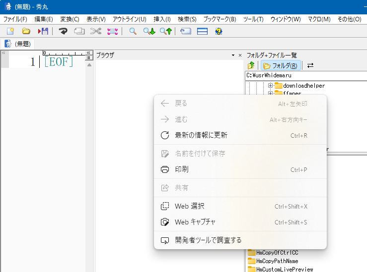

# 「空のブラウザ枠」に次のようなマクロを送信してみる

```
setbrowserpaneurl "javascript:window.scrollBy(0,100);";
```

これにより、ブラウザ枠のみならず秀丸エディタが異常状態になっている  
(何かのタスク終了を待ち続けており、結果、マクロが終了しない状態だと思われる)


# 異常状態になっている時の様子
秀丸がおそらくマクロ実行中扱いとなってしまい、ほとんど操作できなくなる。  
秀丸を閉じると、終了時に保護違反が発生する。

ブラウザ枠にて右クリックすると次のようなWebView2の元来のコンポーネントが出るので異常な状態かどうかがわかりやすい  



# ４台でこの異常状態の再現を試みた

異なるマシンでこの異常状態の再現をトライしたところ、３台は全く同様に再現し、  
１台は通常状態では再現しなかったが、とある方法で再現した。

|  マシン名  |  OS  | バージョン | ビルド | バグ再現 |
|---|---|---|---|---|
| r9-3950x-X570  | Windows 11 Pro | 22H2 | 22621.1344 | デフォルトで100％ |
| i9-9900ks-B365 | Windows 11 Pro | 22H2 | 22621.1344 | デフォルトで100％ |
| i7-9700-H310 | Windows 11 Pro | 22H2 | 22621.1344 | デフォルトで100％ |
| i7-9700-H310 | Windows 11 Pro | 22H2 | 22621.1344 | デフォルトで100％ |
| WIN-04C2GHFAIT1 | WinServer 2022 Datacenter | 21H2 | 20348.1547 | デフォルトではなく**WebView2 Runtimeを入れると**100％発生 |

# 異常状態のダンプ

対象秀丸 : hm921b2_x64_signed.exe
ダンプを５つ提供する上記４つのマシンでのダンプ。
秀丸エディタ32bit版のみならず、**秀丸エディタ64bit版でも同様の状況**が再現されると思われる。
|ファイル名|
|---|
|dump_[r9-3950x-X570].txt|
|dump_new_install_[r9-3950x-X570].txt <br> (上のマシンに秀丸を新規にインストールしたもの [設定などは復元しない状態])|
|dump_[i9-9900ks-B365].txt|
|dump_[i7-9700-H310].txt|
|dump_[WIN-04C2GHFAIT1].txt|
上から２番目のものは、秀丸を新規にインストールしたものであるが、まったく同様に再現した。

# 原因は<span style="color: red;">WebView2Runtimeの「インストールの有無」</span>に大きく関わっている可能性が高い

マシン「WIN-04C2GHFAIT1」のみ状況が異なったので、  
OS自体異なるが、そもそも「WebView2コンポーネントをこのマシンにはインストールしていない」という差があるため
https://developer.microsoft.com/ja-jp/microsoft-edge/webview2/
の一番下の左の「ダウンロード」からそのままダウンロードし「MicrosoftEdgeWebview2Setup」を実行し、  
インストールすると、「WIN-04C2GHFAIT1」のマシンでも100％異常状態が再現する形となった。  

その後、インストールしたWebView2コンポーネントをアンインストールすると、  
「WIN-04C2GHFAIT1」の状態は元へと戻った。  
(少なくとも「冒頭のマクロを実行しただけで即座に異常」といったことにはならず、  
サイト企画開発サイドが現行の段階で想定していたであろう挙動らしい動作)

